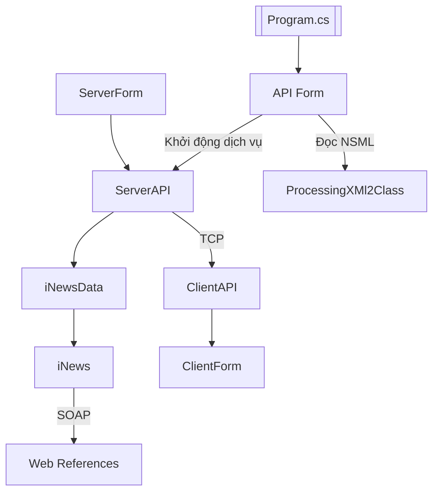
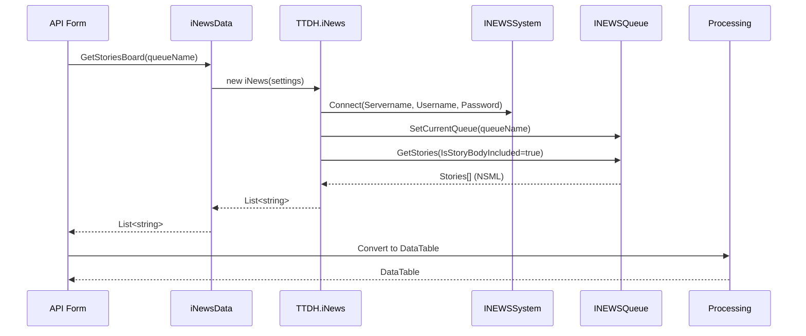
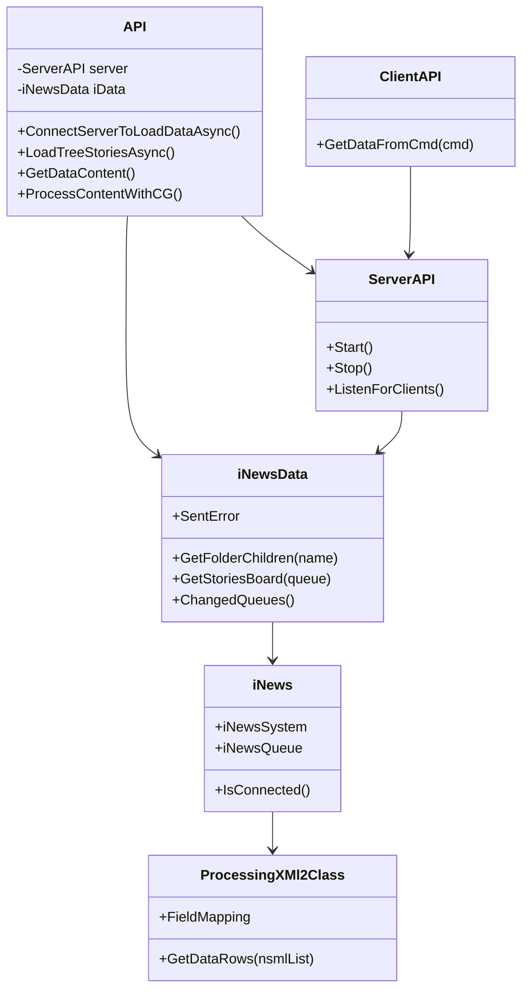

# Tổng quan kiến trúc INEWS Tools

## Kiến trúc lớp & module
Ứng dụng tách thành ba lớp chính:

1. **UI WinForms** – các form `API`, `ServerForm`, `ClientForm`, `APIV4` để người dùng tương tác.
2. **Dịch vụ nội bộ** – `ServerAPI` (TCP server) và `ClientAPI` (TCP client kiểm thử) trung gian trao đổi dữ liệu.
3. **Truy xuất iNews** – `iNews`, `iNewsData`, `ProcessingXMl2Class` gọi SOAP Web Service và chuyển NSML thành `DataTable`.



## Luồng khởi động & kết nối iNews
Quy trình kết nối rất quan trọng và diễn ra trong `API.ConnectServerToLoadDataAsync`:

1. **Đọc cấu hình TCP**: lấy `ServerIP`, `WorkingFolder` từ `app.config`.
2. **Khởi tạo ServerAPI**: truyền `ServerIP`, đăng ký sự kiện `Recieve`, gọi `Start()` để lắng nghe TCP.
3. **Nạp thông số iNews**: đọc `iNewsServer`, `iNewsServerBackup`, `iNewsUser`, `iNewsPass`, `QueuesRoot`, `QueuesChild`.
4. **Tạo `WebServiceSettings`**: gán các giá trị ở bước 3 rồi khởi tạo `iNewsData` với settings này.
5. **Kết nối SOAP**: khi `iNewsData` cần dữ liệu, nó khởi tạo `TTDH.iNews`:
   - Sinh `INEWSSystem` và `INEWSQueue` (proxy trong `Web References`).
   - Tạo `CookieContainer` dùng chung cho cả hai dịch vụ.
   - Thiết lập `Timeout = 5000ms`.
   - Gọi `INEWSSystem.Connect` với `ConnectType` chứa `Servername`, `Username`, `Password` từ settings.
   - Nếu kết nối thất bại và có `ServerBackup`, hàm tự thử lại.
6. **Kiểm tra kết nối**: `iNews.IsConnected()` gọi `INEWSSystem.IsConnected` để xác nhận.
7. **Dựng cây rundown**: `API.LoadTreeStoriesAsync` đọc `QueuesRoot`, sử dụng `iNewsData.GetFolderChildren` để lấy queue con cho từng node.

Mọi lỗi khi kết nối hoặc gọi SOAP đều được truyền qua `iNewsData.SentError` để form hiển thị trong `toolStripStatusLabel1`.

```mermaid
flowchart TD
    Start([Program]) --> Init[API_Load]
    Init --> ReadCfg[Đọc appSettings]
    ReadCfg --> StartTCP[Khởi động ServerAPI (ServerIP)]
    StartTCP --> BuildSettings[Tạo WebServiceSettings]
    BuildSettings --> CreateIData[Khởi tạo iNewsData]
    CreateIData --> LoadTree[LoadTreeQueuesAsync]
    LoadTree --> Ready[UI sẵn sàng]
```

## Lấy danh sách queue & story
### Lấy queue con
1. Khi mở rộng node, `treeView1_BeforeExpand` gọi `iNewsData.GetFolderChildren` với `FolderFullName` từ `TreeNode.Tag`.
2. `GetFolderChildren` tạo `GetFolderChildrenType`, gọi `iNews.iNewsSystem.GetFolderChildren`, trả về `Children` danh sách folder.
3. UI thêm node con và gán `Tag = parent.Tag + "." + child` để tiếp tục lazy-load.

### Lấy story trong rundown
1. `treeView1_AfterSelect` chuẩn bị tên queue (`selectedName`). Nếu có `QueuesChild`, ghép thêm hậu tố.
2. Trong `Task.Run`, `iNewsData.GetStoriesBoard` thực thi:
   - `SetCurrentQueueType.QueueFullName = queueName` rồi gọi `INEWSQueue.SetCurrentQueue`.
   - Cấu hình `GetStoriesType` (`IsStoryBodyIncluded = true`, `NumberOfStoriesToGet = 240`, `Navigation = SAME`).
   - Gọi `INEWSQueue.GetStories` để lấy danh sách NSML.
3. Trả về `List<string>` story NSML cho `ProcessingXMl2Class`.
4. `ProcessingXMl2Class.GetDataRows` map trường dựa trên cấu hình `Fields` và tạo `DataTable`.
5. `dataGridView1` bind `DataTable`, textbox hiển thị nội dung story đã chọn.



## Dịch vụ TCP nội bộ
- `ServerAPI` nhận lệnh qua TCP (mặc định cổng do `ServerIP` xác định) như `GET_TREE`, `QUEUE|<FullName>`.
- Với mỗi lệnh, server sử dụng lại instance `iNewsData` để đọc queue/story rồi trả về chuỗi (XML/NSML).
- `ClientForm` dùng `ClientAPI.GetDataFromCmd` để gửi lệnh và hiển thị kết quả, phục vụ kiểm thử nhanh.

## Parser & xử lý nội dung
- `ProcessingXMl2Class` đọc `Fields` (ví dụ `title,page-number`) để map từng tag NSML vào cột `DataTable`.
- Phần nội dung story gốc lưu vào `Content` để các nút xuất file dùng regex (`##CG`, `##DD`, `KeyTroiTin`, `KeyTroiCuoi`).
- Xuất file sử dụng UTF-8 không BOM để bảo toàn dấu tiếng Việt.

## Sơ đồ UML tổng quan


## Cấu trúc dữ liệu & cấu hình
- **Không sử dụng database**; dữ liệu story nằm trong NSML trả về từ iNews.
- `app.config` là nguồn cấu hình duy nhất cho thông tin kết nối, thư mục xuất file và khóa trích xuất.
- `BarTypeConfiguration` đọc `BarScene` & `BarLocaltion` để hỗ trợ xuất bar value (dùng trong `APIV4`).

## Đề xuất cải tiến
- Xử lý triệt để nút `Get Stories` trống trong `ClientForm`.
- Cân nhắc bỏ `ProcessContentWithPhude` và khóa `Phude` nếu không còn nhu cầu xuất file phụ đề.
